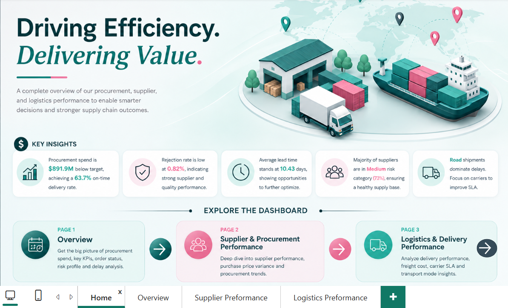
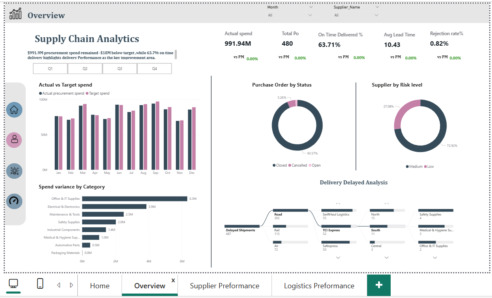

# Supply Chain Performance Analysis

## 📌 Project Overview

An end-to-end Power BI project designed to analyze supply chain performance across procurement, supplier management, and logistics operations.

The project covers the full analytical workflow — from data preparation and transformation to data modeling, DAX measures, and interactive dashboard development.

The final report provides an interactive analytical experience that enables users to monitor supply chain KPIs, evaluate supplier performance, analyze procurement spend, and assess logistics and delivery performance.

---

# 🔄 Data Preparation & Transformation

A significant part of the project focused on preparing and transforming the raw data before building the analytical model.

Using **Power Query**, the data was cleaned, transformed, and prepared for analysis through multiple transformation steps, including:

* Data cleaning and preprocessing
* Data type corrections and standardization
* Handling missing and inconsistent values
* Removing unnecessary data
* Creating and transforming calculated fields
* Splitting and merging columns where required
* Data filtering and shaping
* Creating conditional logic
* Standardizing categorical values
* Combining and restructuring data from different fields
* Preparing business-ready datasets for the analytical model

These transformations were performed to ensure that the data was consistent, reliable, and suitable for KPI calculations and business analysis.

---

# 🧮 Data Modeling & DAX

The transformed data was structured into an analytical data model designed to support efficient supply chain analysis.

### Data Modeling

* Combined and organized data from multiple tables.
* Identified and structured **Fact and Dimension tables** based on business requirements and analytical grain.
* Designed relationships between the different tables to support cross-filtering and analysis.
* Created a dedicated **Date Table** to support time-based analysis and calculations.
* Structured the model to support procurement, supplier, and logistics analysis.

### DAX

Created DAX measures to calculate and monitor key business metrics, including:

* Actual Spend
* Purchase Orders
* On-Time Delivery %
* Average Lead Time
* Rejection Rate %
* Supplier Rating
* Quality Score
* Delivery Score
* Purchase Price Variance %
* Freight Cost
* Transit Time
* Delayed Shipments
* SLA Gap
* Month-over-Month performance
* Actual vs. Target performance

The measures were designed to work dynamically with the report's filters and slicers.


# 🗂️ Data Model

The project uses a **Galaxy Schema (Fact Constellation)**, where multiple Fact tables share common Dimension tables through defined relationships.

The model is designed to support analysis across different supply chain processes, including procurement, supplier performance, and logistics.


# 🎯 Business Objectives

The dashboard was designed to help answer key supply chain questions, including:

* How is overall procurement performance evolving over time?
* How does actual procurement spend compare with the target?
* Which suppliers are performing across price, quality, and delivery?
* Where are purchase price variances occurring?
* How effectively are shipments being delivered on time?
* How does logistics performance vary across carriers, transportation modes, and regions?
* Where are potential delivery and SLA gaps occurring?


# 📷 Dashboard Preview

## Home



## Overview



## Supplier Performance


## Logistics Performance


# 🛠️ Tools & Technologies

* **Power BI** — Dashboard development, data modeling, and interactive visualization
* **Power Query** — Data cleaning, transformation, and preparation
* **DAX** — KPI calculations, time-based analysis, and business measures
* **Data Modeling** — Fact & Dimension tables, relationships, and Date Table


# 📁 Project Structure

```text
Supply-Chain-Analysis/
│
├── data source/
│   └── supply_chain_data.csv
│
├── images/
│   ├── home.png
│   ├── overview.png
│   ├── Supplier Performance.png
│   ├── Logistics Performance.png
│   └── Data Model.png
│
├── Supply Chain Analysis.pbix
└── README.md
```


